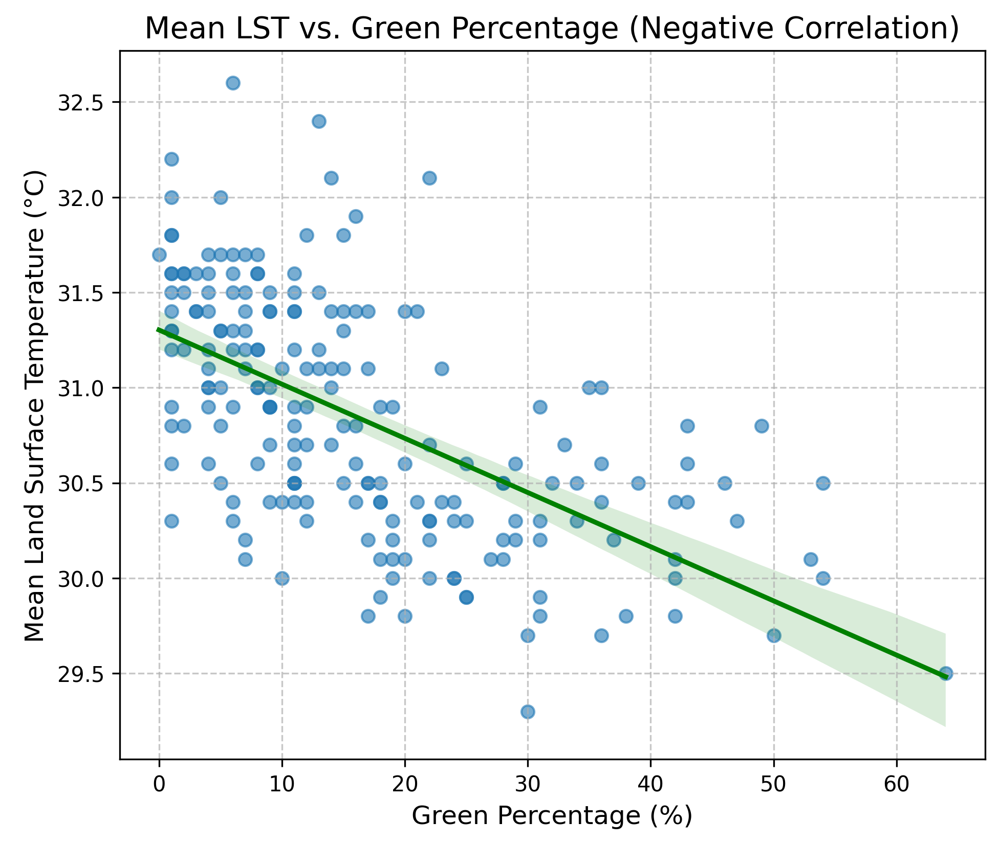
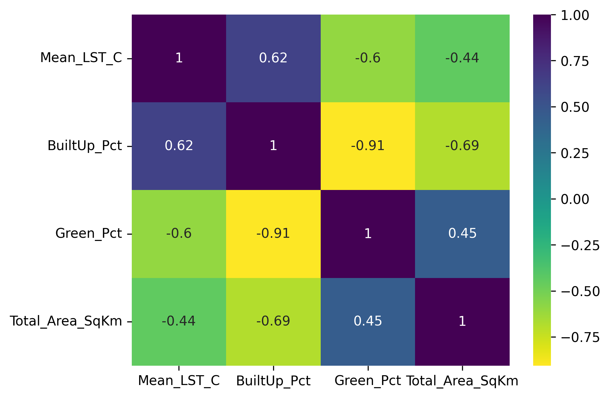
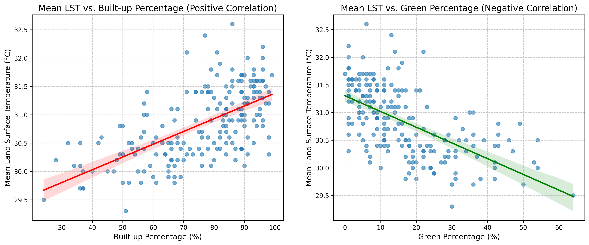
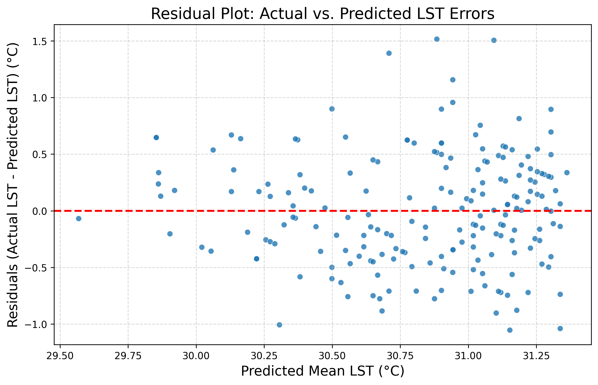
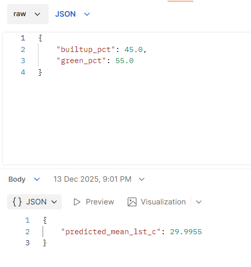

# Bengaluru UHI Prediction and Cool-Roof Prioritisation

**A supervised regression analysis predicting ward-level mean Land Surface Temperature across 198 BBMP wards of Bengaluru from two satellite-derived land-cover features, coupled with a downstream prioritization procedure identifying the wards where cool-roof retrofit interventions would have the greatest expected thermal impact.**

   



---

## Motivation

Urban Heat Island (UHI) effects are unevenly distributed across Bengaluru's administrative wards, and the budget available for thermal-adaptation interventions is limited. The prediction of ward-level Land Surface Temperature (LST), while methodologically interesting in its own right, addresses only the first half of the planning problem; the second half is the allocation of finite intervention capacity across a heterogeneous urban landscape.

This analysis pursues two coupled objectives. First, to construct a parsimonious, interpretable model relating mean ward LST to land-use composition. Second, to operationalise that model into a ranked prioritisation of the wards most suited to cool-roof retrofit deployment. The intent is to demonstrate not merely that a model can be fitted, but that its outputs can be translated into a defensible intervention recommendation.

---

## Data

LST values were derived from the **MODIS/061/MOD11A2** product, an 8-day composite at 1 km spatial resolution. The relevant band (`LST_Day_1km`) was scaled by the MODIS factor of 0.02 and converted from Kelvin to Celsius. The three-year window of 1 January 2022 to 31 December 2024 was used to smooth seasonal and monsoon-related variability, producing a stable long-term mean. Spatial aggregation was performed via `ee.Reducer.mean()` over each of the 198 BBMP ward geometries in Google Earth Engine.

Land-use composition features (built-up percentage and green-cover percentage) were derived from Sentinel-2 Dynamic World classifications, aggregated to the same ward geometry. Full data documentation is provided in [`DATA.md`](./DATA.md).

The resulting dataset comprises 198 records, each consisting of two predictor variables and one target variable, with no missing values.

---

## Method

A simple **linear regression** was specified with two predictors — built-up percentage and green-cover percentage — and ward-level mean LST as the target. The model was implemented in scikit-learn, trained on a stratified train–test split, and serialised via `joblib` for deployment behind a Flask REST API.

The choice of linear regression over more flexible alternatives was deliberate. The objective was not maximum predictive accuracy but a coefficient structure that could be interpreted and defended in a policy context. A gradient-boosted ensemble would likely yield a marginally lower error but would obscure the directional contribution of each feature.

Diagnostic validation included inspection of the residual plot for systematic bias and heteroscedasticity, correlation analysis between predictors and target, and held-out test-set evaluation.

---

## Results

### Fitted model

| Item | Value |
|---|---|
| Algorithm | Linear Regression |
| Features | `BuiltUp_Pct`, `Green_Pct` |
| Target | `Mean_LST_C` (long-term mean LST in °C, 2022–2024) |
| Coefficients | BuiltUp_Pct: **+0.0168**, Green_Pct: **−0.0084** |
| Intercept | **29.70 °C** |
| Granularity | 198 BBMP wards |
| Spatial resolution | 1 km (MODIS MOD11A2) |

The fitted coefficients admit the following interpretation: a one-percentage-point increase in built-up area is associated with a 0.017 °C increase in mean LST, while a one-percentage-point increase in green cover is associated with a 0.008 °C decrease. The magnitude of the built-up coefficient is therefore approximately twice that of the green-cover coefficient. This asymmetry has direct policy implications: at the margin, the thermal effect of densification exceeds the thermal effect of revegetation by a factor of two, suggesting that retrofitting of existing built fabric may offer a higher per-unit return than equivalent investment in new green cover.

### Diagnostics

**Correlation structure between features and target:**





**Residual analysis.** The residual plot was inspected to verify the standard linear-regression assumptions of homoscedasticity and the absence of systematic bias across the prediction range.



**Predicted versus actual LST on the held-out test set:**



### Downstream prioritisation

Model outputs were combined with the underlying ward feature profile to surface the ten wards expected to benefit most from cool-roof retrofit intervention. The output is preserved in [`BBMP_Cool_Roof_Prioritization_Top_10.csv`](./BBMP_Cool_Roof_Prioritization_Top_10.csv).

| Rank | Ward | Zone | Mean LST (°C) | Built-up % | Green % |
|---|---|---|---|---|---|
| 1 | Rajagopal Nagar | Dasarahalli | 32.6 | 86 | 6 |
| 2 | Peenya Industrial Area | Dasarahalli | 32.4 | 77 | 13 |
| 3 | Laggere | Rajarajeswari Nagar | 32.2 | 96 | 1 |
| 4 | HMT Ward | Rajarajeswari Nagar | 32.1 | 71 | 22 |
| 5 | Lakshmi Devi Nagar | Rajarajeswari Nagar | 32.1 | 81 | 14 |
| 6 | Hegganahalli | Dasarahalli | 32.0 | 96 | 1 |
| 7 | Gali Anjenaya Temple ward | South | 32.0 | 91 | 5 |
| 8 | Jagajivanaramnagar | West | 31.9 | 82 | 16 |
| 9 | Nandini Layout | West | 31.8 | 79 | 15 |
| 10 | Vrisabhavathi Nagar | West | 31.8 | 93 | 1 |

The prioritised wards concentrate spatially in the north-west of the city, within the Dasarahalli and Rajarajeswari Nagar administrative zones. They share a consistent feature profile of built-up percentages above 80% and green-cover percentages in single digits. This concentration provides external qualitative validation of the prioritisation: the identified set corresponds to areas widely recognised, on the basis of independent observation, as among the most thermally stressed neighbourhoods in the city.

---

## Discussion

### Choice of a two-feature linear model

The decision to restrict the model to two predictors and a linear functional form constrains predictive performance but produces an output that can be interpreted and audited. In a planning context, the relative magnitudes of the coefficients — the finding that built-up density exerts twice the thermal effect of green cover per percentage point — are themselves the principal finding, and their stability across the dataset is more important than marginal error reduction. The inclusion of additional features such as surface albedo, water-body proximity, and elevation would likely improve R², but at the cost of complicating the policy narrative around any individual coefficient.

### Translation of prediction into intervention ranking

A common limitation of urban-climate ML work is the absence of an explicit translation step between model output and policy decision. The cool-roof prioritization produced here is a deliberate attempt to construct that translation: the ranking surfaces wards in which the joint conditions of high LST and a feature profile amenable to cool-roof intervention coincide. The output is intended not as a final allocation but as a defensible starting point for further consultation with municipal stakeholders.

---

## Limitations

- **Spatial resolution.** The 1 km MODIS resolution is appropriate for ward-level planning but cannot resolve sub-ward heterogeneity. The model should not be used for building-scale design decisions.
- **Land Surface Temperature versus ambient air temperature.** The target variable is LST, which is the appropriate metric for radiative balance and reflective-surface interventions, but it is not equivalent to ambient air temperature as experienced by residents. Communication of model outputs to non-technical audiences must respect this distinction.
- **Restricted feature scope.** Only two predictors are used. Inclusion of albedo, water-body proximity, and elevation would likely improve predictive accuracy but reduce coefficient interpretability.
- **Static features and temporal aggregation.** Features are derived from long-term means. The model diagnoses present-state ward conditions and does not forecast the thermal consequences of future development trajectories.
- **Ward boundary set.** The analysis uses the 198-ward BBMP boundary set rather than the current 369-ward Greater Bengaluru Authority boundary. Re-extraction onto the GBA boundary is identified as the natural extension of this work.

---

## Project structure

```
bengaluru-uhi-prediction/
├── Bengaluru LST Prediction API.ipynb         # Training notebook with diagnostics
├── LST_predictor.py                           # Flask API entrypoint
├── model_coefficients.json                    # Human-readable model coefficients
├── BBMP_Cool_Roof_Prioritization_Top_10.csv   # Downstream prioritisation output
├── Correlation_heatmap.png                    # Diagnostic plots
├── Correlation_inferences.png
├── LSTvsGreenCover.png
├── Residual_plot.png
├── test_predictions.png
├── DATA.md                                    # Data source and extraction pipeline
├── requirements.txt
├── data/                                      # MODIS and LULC ward-level CSVs
└── model/                                     # Trained model artefacts (joblib)
```

---

## Reproducibility

### 1. Install dependencies

```bash
pip install -r requirements.txt
```

`requirements.txt`:
```
flask==3.1.2
joblib==1.5.2
pandas==2.3.1
scikit-learn==1.7.2
```

### 2. Run the API

```bash
python LST_predictor.py
```

The service starts at `http://127.0.0.1:5000`.

### 3. Request a prediction

```bash
curl -X POST \
  -H "Content-Type: application/json" \
  -d '{"builtup_pct": 86.0, "green_pct": 6.0}' \
  http://127.0.0.1:5000/predict_lst
```

Expected response:
```json
{"predicted_mean_lst_c": 31.099}
```

The feature values used in the example above correspond to Rajagopal Nagar, the highest-ranked ward in the prioritisation output.

---

## Related work

- **[bengaluru-ward-climate-clustering](https://github.com/Rupali-Gauravaram/bengaluru-ward-climate-clustering)** — Unsupervised K-Means partitioning of the same 198-ward dataset into four climate-vulnerability archetypes. Cross-validates the prioritisation output produced here.
- **[Bengaluru_LST_Prediction_API](https://github.com/Rupali-Gauravaram/Bengaluru_LST_Prediction_API)** — The original v1 of this work, focused on the prediction API alone.
- **Part 1: Technical Deep Dive** — [chaiandcode.wordpress.com](https://chaiandcode.wordpress.com/2025/12/12/bengaluru-lst-prediction-api-part-1/)
- **Part 2: Strategic Vision** — [chaiandcode.wordpress.com](https://chaiandcode.wordpress.com/2025/12/12/bengaluru-lst-prediction-api-part-2/)
- **[Bengaluru Quorum](https://linkedin.com/company/bengaluru-quorum)** — The climate-intelligence platform for which this work provides foundational analysis.

---

## Author

**Rupali Gauravaram** — Climate Tech enthusiast, building [Bengaluru Quorum](https://linkedin.com/company/bengaluru-quorum). MSc Climate Resilience & Environmental Sustainability (University of Liverpool, 2024). Advanced AI/ML certification, IIT Roorkee (August, 2026).

[LinkedIn](https://linkedin.com/in/rupali99) · [GitHub](https://github.com/Rupali-Gauravaram) · [Blog: Chai & Code](https://chaiandcode.wordpress.com)
